# 🤖 ACEBOTT ESP32 Car Shield V2.0 — Kit QD001

> Kit educativo de vehículo inteligente con ruedas Mecanum, múltiples modos de control y soporte para paquetes de expansión.

<p align="center">
  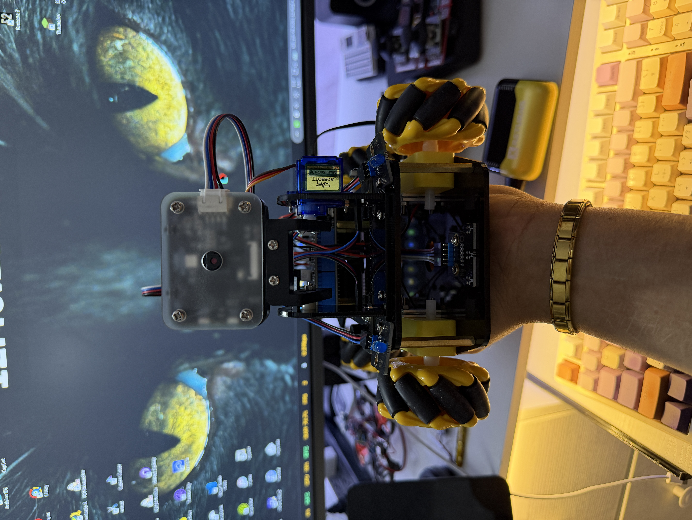
</p>

<p align="center">
  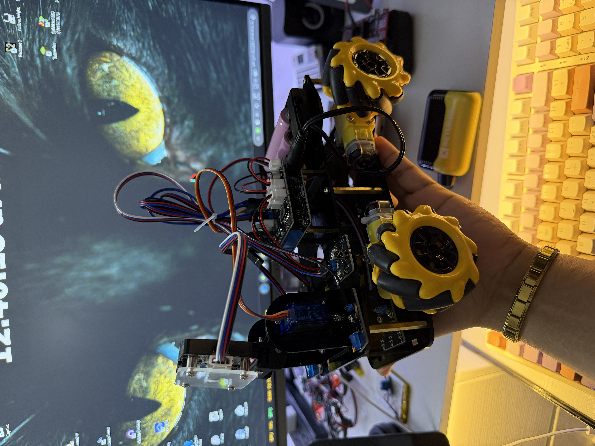
  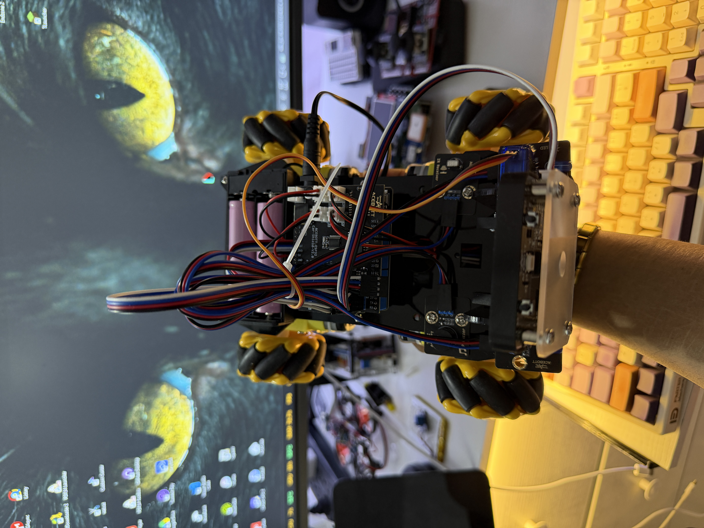
</p>

---

## 📋 Tabla de contenidos

1. [¿Qué es este kit?](#-qué-es-este-kit)
2. [Lista de componentes](#-lista-de-componentes)
3. [Seguridad — leer antes de armar](#️-seguridad--leer-antes-de-armar)
4. [Guía de ensamblaje paso a paso](#-guía-de-ensamblaje-paso-a-paso)
5. [Diagrama de conexiones y pines](#-diagrama-de-conexiones-y-pines)
6. [Instalación de Arduino IDE](#-instalación-de-arduino-ide)
7. [Instalación del soporte para ESP32](#-instalación-del-soporte-para-esp32)
8. [Instalación de librerías](#-instalación-de-librerías)
9. [Modos de control disponibles](#-modos-de-control-disponibles)
10. [Descripción de cada sketch](#-descripción-de-cada-sketch)
11. [Tests individuales de componentes](#-tests-individuales-de-componentes)
12. [Preguntas frecuentes y solución de problemas](#-preguntas-frecuentes-y-solución-de-problemas)
13. [Paquetes de expansión compatibles](#-paquetes-de-expansión-compatibles)
14. [Créditos y soporte](#-créditos-y-soporte)

---

## 🚗 ¿Qué es este kit?

El **ACEBOTT QD001** es un vehículo inteligente educativo basado en el microcontrolador **ESP32**, diseñado para aprender robótica, programación y electrónica de forma práctica.

Sus ruedas **Mecanum** permiten moverse en cualquier dirección: adelante, atrás, lateralmente y en diagonal, sin necesidad de girar el vehículo. Esto lo hace especialmente interesante desde el punto de vista de la mecánica y programación.

<p align="center">
  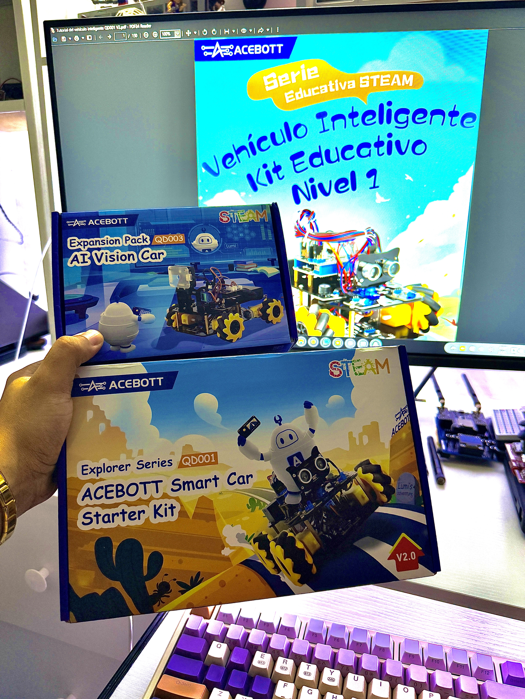
</p>

<p align="center">
  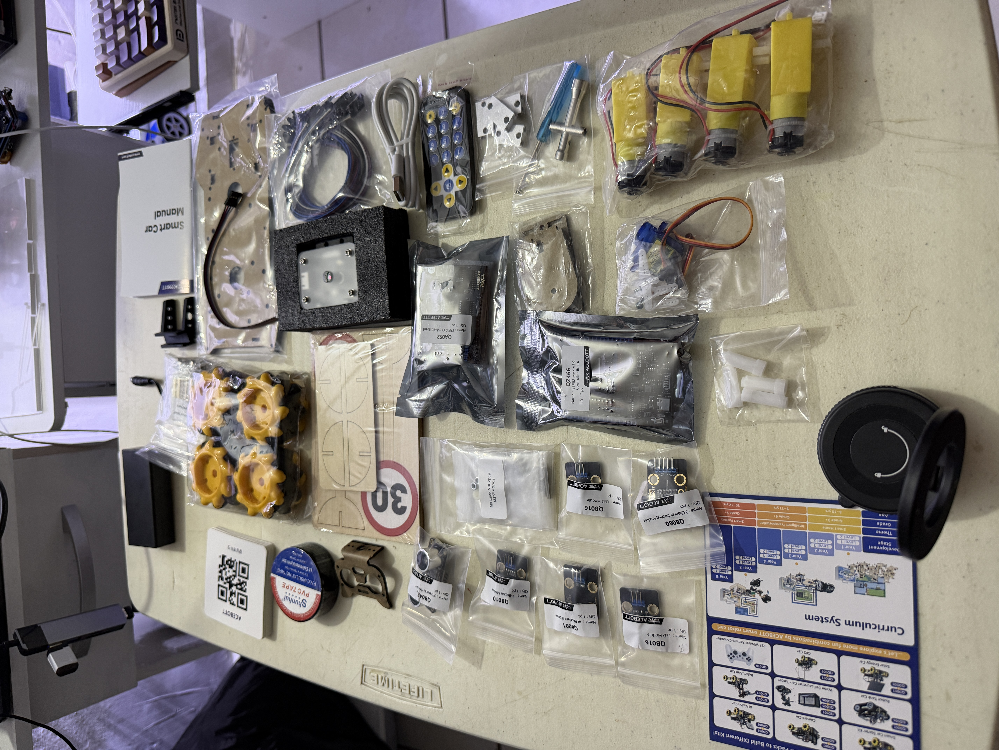
</p>

**Modos de control incluidos en este repositorio:**

| Modo | Descripción |
|------|-------------|
| 🤖 Autónomo | El carrito evita obstáculos solo, usando servo + sensor ultrasónico |
| 📱 App ACEBOTT | Control manual desde tu celular por WiFi |
| 📡 Control IR | Control con el mando infrarrojo incluido en el kit |
| 🎮 ESP-NOW | Control remoto con un segundo ESP32 y joysticks analógicos |
| 📷 Cámara QD003 | Pruebas de visión AI (expansión opcional) |

---

## 📦 Lista de componentes

> ⚠️ **IMPORTANTE:** Este kit **NO incluye baterías 18650**. Debes comprarlas por separado. Necesitas **2 baterías 18650 tipo BOTÓN SUPERIOR** (con circuito de protección integrado).

<p align="center">
  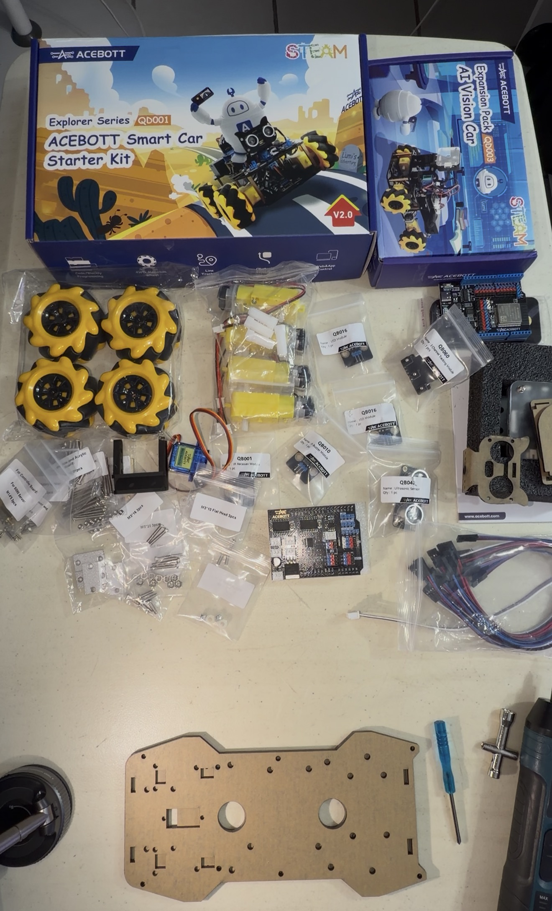
</p>

### Componentes electrónicos

| Componente | Cantidad | Descripción |
|------------|----------|-------------|
| Placa ESP32 Max V1.0 | 1 | Microcontrolador principal con WiFi y Bluetooth integrado |
| Shield Auto ESP32 | 1 | Placa de expansión que conecta todos los módulos al ESP32 |
| Módulo LED azul | 2 | LEDs direccionales (izquierdo y derecho) |
| Módulo Buzzer Pasivo | 1 | Bocina para señales de audio |
| Módulo receptor IR | 1 | Receptor infrarrojo para el control remoto |
| Sensor ultrasónico HC-SR04 | 1 | Mide distancias para detectar obstáculos |
| Sensor de seguimiento de línea | 1 | Detecta líneas en el suelo (seguidor de línea) |
| Motor TT DC con engranaje | 4 | Motores de las 4 ruedas |
| Rueda Mecanum | 4 | Ruedas especiales que permiten movimiento omnidireccional |
| Servomotor SG90 9G | 1 | Mueve el sensor ultrasónico izquierda/derecha para escanear |
| Control remoto IR | 1 | Mando infrarrojo incluido en el kit |
| Porta batería 18650 | 1 | Soporte para 2 baterías 18650 |

### Piezas mecánicas y de ensamblaje

| Pieza | Cantidad |
|-------|----------|
| Chasis de acrílico (inferior y superior) | 1 set |
| Soportes para motor | 4 |
| Acopladores para ruedas | 4 |
| Soporte para sensor ultrasónico | 1 |
| Separadores hexagonales cobreados M3×40mm | 6 (dobles) |
| Separadores hexagonales cobreados M3×14mm | 5 |
| Tornillos M3×10mm cabeza redonda | ~39 |
| Tornillos M3×30mm cabeza redonda | 10 |
| Tornillos M2×10mm cabeza redonda | 8 |
| Tornillos M3×8mm cabeza plana | 5 |
| Tornillos autoperforantes M2×25mm | 4 |
| Tornillos autoperforantes M1.4×5mm | 3 |
| Tuercas M3 niqueladas | ~31 |
| Tuercas M2 niqueladas | 8 |
| Cables Dupont H-H 3 pines | 6 |
| Cables Dupont H-H 4 pines | 2 |
| Cables Dupont H-H 5 pines | 2 |
| Cable USB | 1 |
| Precintos de nailon | 3 |
| Cinta negra | 1 |
| Destornillador | 1 |
| Llave cruz | 1 |

### Lo que necesitas comprar por separado

- **2 baterías 18650 con botón superior** y circuito de protección (PCM). No uses baterías sin protección.
- Para el modo **Control ESP-NOW**: un segundo ESP32 + 2 joysticks analógicos + pantalla OLED SSD1306 (basado en el diseño del control de drone).

---

## ⚠️ Seguridad — leer antes de armar

### Seguridad general

- ❌ No apto para niños menores de 3 años (piezas pequeñas)
- ✅ Recomendado para mayores de 10 años bajo supervisión adulta
- ⚠️ Ten cuidado con bordes afilados del acrílico
- 🚫 Nunca gires manualmente los motores o el servo con la mano — puedes dañarlos

### Seguridad eléctrica

- ✅ Usa **solo baterías 18650 protegidas** (con PCM integrado)
- ❌ Nunca uses baterías dañadas o sin circuito de protección
- ⚠️ Presta atención a la **polaridad** al insertar las baterías (+/-)
- 🔌 Usa solo un cargador adecuado para las baterías 18650
- 🔵 Apaga siempre el interruptor después de usar el carrito
- 📦 Si no lo vas a usar por mucho tiempo, retira las baterías

### Limpieza y mantenimiento

- Limpia solo con paño seco, sin agua ni solventes
- Revisa el estado de las baterías regularmente
- Si alguna batería tiene daño visible, deja de usarla inmediatamente

---

## 🔧 Guía de ensamblaje paso a paso

> 💡 **Tip:** Antes de comenzar, organiza todos los tornillos y piezas sobre una superficie limpia. Usa el manual físico o el PDF incluido como referencia visual de cada paso.

<p align="center">
  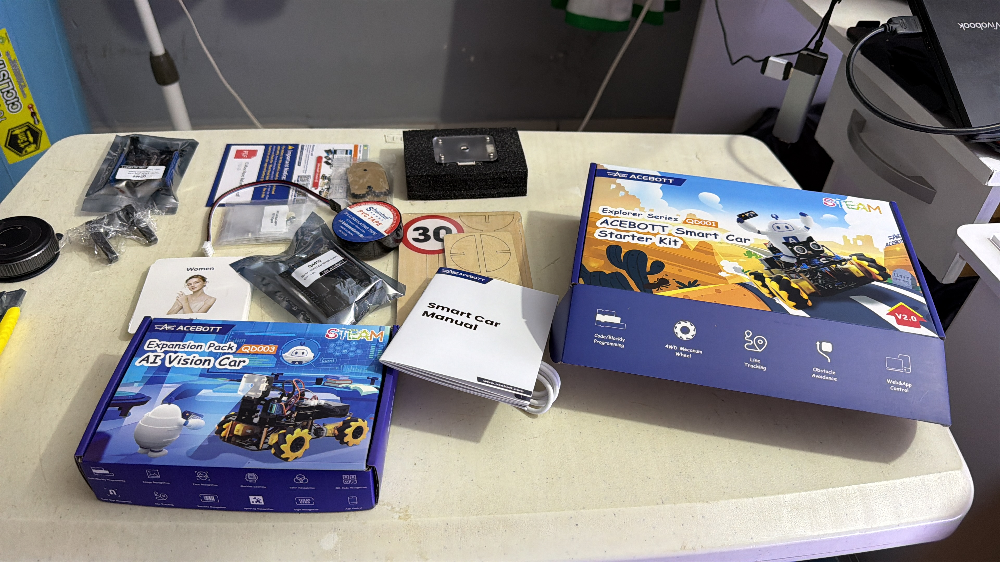
</p>

---

### Etapa 1 — Instalar el sensor de seguimiento de línea

**Piezas necesarias:**
- Chasis inferior de acrílico × 1
- Sensor de seguimiento × 1
- Tornillos M3×10mm × 2
- Tuercas M3 × 2
- Cable Dupont 5 pines × 1

**Conexión del cable del sensor de seguimiento:**

| Color del cable | Pin del sensor |
|-----------------|----------------|
| Rojo | V (5V) |
| Negro | G (GND) |
| Azul | L (GPIO 35) |
| Blanco | M (GPIO 36) |
| Gris | R (GPIO 39) |

> ℹ️ El chasis inferior tiene un agujero específico para montar el sensor de seguimiento en la parte de abajo.

<p align="center">
  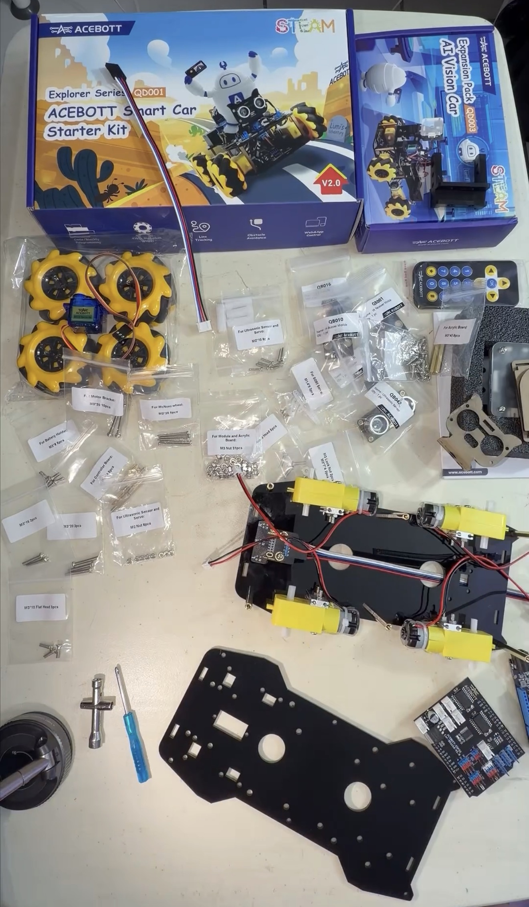
</p>

---

### Etapa 2 — Instalar los pilares de cobre en el chasis inferior

**Piezas necesarias:**
- Separadores hexagonales cobreados dobles M3×40mm × 6
- Tornillos M3×10mm × 6

Atornilla los 6 separadores en el chasis inferior. Estos elevarán el chasis superior y darán espacio al porta baterías.

<p align="center">
  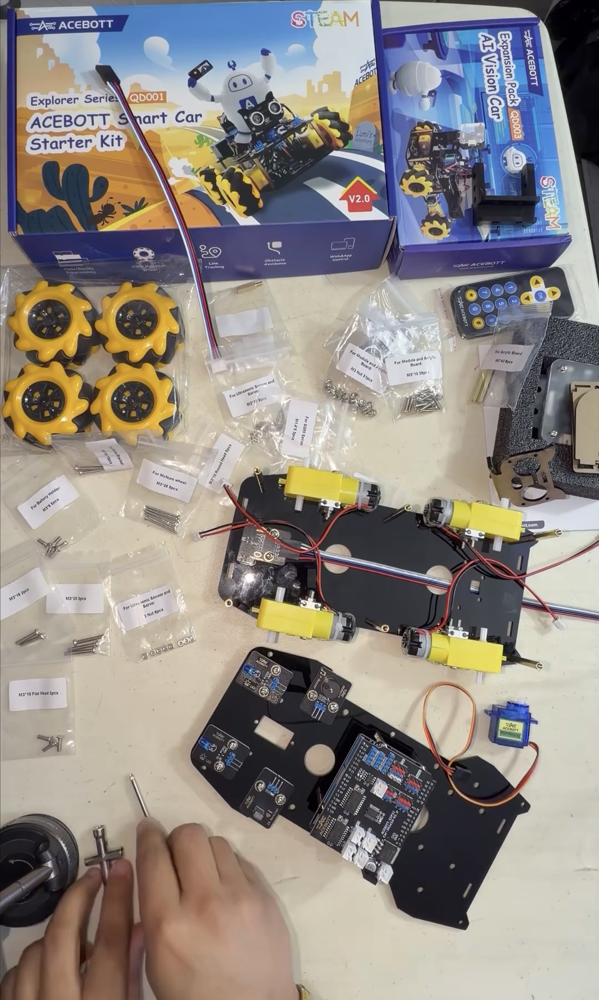
</p>

---

### Etapa 3 — Instalar los motores y soportes

**Piezas necesarias:**
- Motores TT DC × 4
- Soportes para motor × 4
- Tornillos M3×10mm × 8
- Tornillos M3×30mm × 8
- Tuercas M3 × 8

> ⚠️ **MUY IMPORTANTE:** La dirección de instalación de cada motor debe ser exactamente como se muestra en el manual. El extremo con los cables del motor debe quedar hacia adentro del chasis. Una instalación incorrecta de los motores hará que las ruedas Mecanum no funcionen correctamente.

<p align="center">
  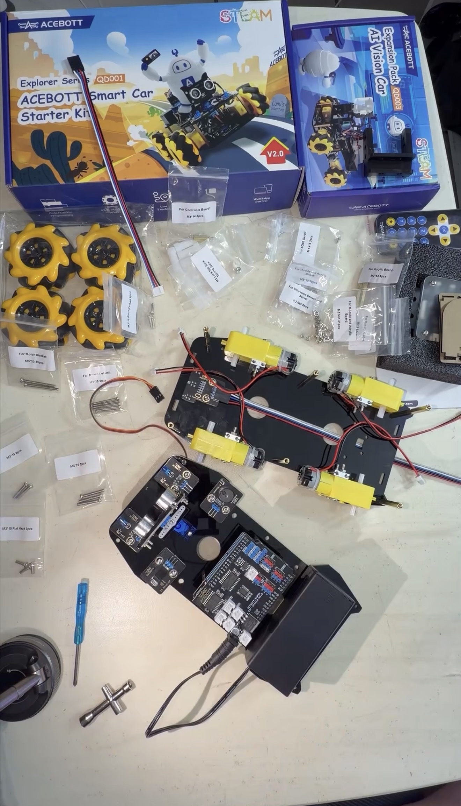
</p>

---

### Etapa 4 — Instalar la placa ESP32 y el Shield

**Piezas necesarias:**
- Placa ESP32 Max V1.0 × 1
- Shield Auto ESP32 × 1
- Chasis superior de acrílico × 1
- Separadores cobreados M3×14mm × 4
- Tornillos M3×10mm × 3
- Tuercas M3 × 4

> ⚠️ Presta atención a la **orientación** del ESP32 y el Shield al montarlos. Deben quedar alineados correctamente con los conectores.
> 
> ℹ️ Solo se fijan **3 tornillos** en esta etapa (el cuarto queda sin tornillo por diseño del kit).

<p align="center">
  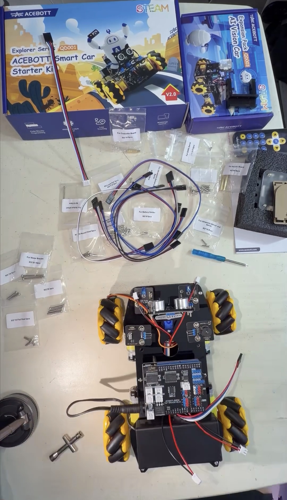
</p>

---

### Etapa 5 — Instalar los módulos LED, Buzzer y receptor IR

**Piezas necesarias:**
- Módulo LED azul × 2 (con tornillos M3×10mm y tuercas)
- Módulo Buzzer Pasivo × 1 (con tornillos M3×10mm y tuercas)
- Módulo receptor IR × 1 (con tornillos M3×10mm y tuercas)

Monta los LEDs en los lados izquierdo y derecho del chasis superior. El Buzzer y el receptor IR van en la parte frontal.

<p align="center">
  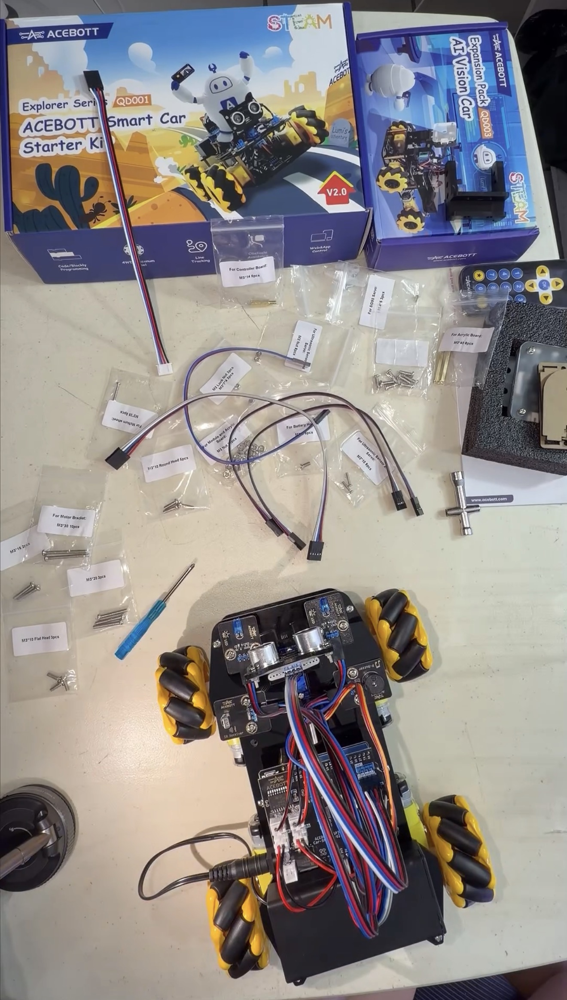
</p>

---

### Etapa 6 — Instalar el servomotor

**Piezas necesarias:**
- Servomotor SG90 9G × 1
- Tornillos M2×10mm × 2
- Tuercas M2 × 2

> ⚠️ Presta atención a la dirección del servo. Debe quedar orientado correctamente para que el sensor ultrasónico pueda girar hacia izquierda y derecha.

**Conexión del cable del servo:**

| Color del cable | Pin del Shield |
|-----------------|----------------|
| Rojo | V |
| Marrón | G |
| Amarillo | Pin 25 (señal PWM) |

> ℹ️ Los colores del servo SG90 son diferentes a los cables Dupont estándar. El cable de señal es **amarillo**, no azul.

---

### Etapa 7 — Instalar el sensor ultrasónico

**Piezas necesarias:**
- Soporte para sensor ultrasónico × 1
- Sensor HC-SR04 × 1
- Tornillos M2×10mm × 4
- Tuercas M2 × 4
- Brazo largo del servo × 1
- Tornillos autoperforantes M1.4×5mm × 2 (vienen en el paquete del servo)

<p align="center">
  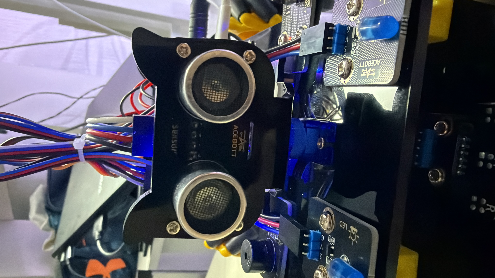
</p>

**Conexión del cable del sensor ultrasónico:**

| Color del cable | Pin del Shield |
|-----------------|----------------|
| Negro | GND |
| Rojo | V (5V) |
| Azul | ECHO (GPIO 14) |
| Blanco | TRIG (GPIO 13) |

> ℹ️ Instala el sensor mirando directamente hacia adelante. Esto es importante para que las medidas de distancia sean correctas.

---

### Etapa 8 — Instalar el porta baterías

**Piezas necesarias:**
- Porta batería 18650 × 1
- Baterías 18650 (las provees tú) × 2
- Tornillos M3×8mm cabeza plana × 4
- Tuercas M3 × 4

> ⚠️ **POLARIDAD:** Presta atención a la polaridad al insertar las baterías. El símbolo `+` debe coincidir con el marcado en el porta batería. Invertir la polaridad puede dañar la placa.

---

### Etapa 9 — Unir los dos chasis

**Piezas necesarias:**
- Tornillos M3×10mm × 6

Une el chasis inferior con el chasis superior usando los 6 tornillos en los separadores de cobre que instalaste en la etapa 2.

---

### Etapa 10 — Instalar las ruedas Mecanum

**Piezas necesarias:**
- Ruedas Mecanum × 4
- Acopladores × 4
- Tornillos autoperforantes M2×25mm × 4

> ⚠️ **MUY IMPORTANTE — Orientación de las ruedas Mecanum:**
> 
> Las ruedas Mecanum **no son intercambiables**. Cada una tiene sus rodillos en un ángulo específico y debe instalarse en la posición correcta. Si se instalan en el orden equivocado, el carrito no podrá moverse lateralmente y girará de forma incorrecta.
>
> Los rodillos de las ruedas deben alinearse con la dirección de la flecha marcada en el chasis para cada posición.

<p align="center">
  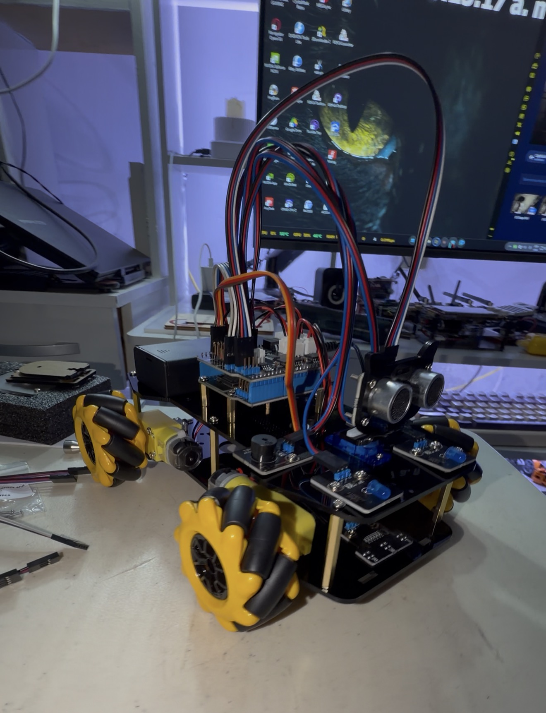
</p>

---

### Cableado final — Guía de colores

```
Cables Dupont estándar (azul/rojo/negro):
  Cable AZUL  → Pin S (señal)
  Cable ROJO  → Pin V (voltaje/alimentación)
  Cable NEGRO → Pin G (tierra/GND)

Servo SG90:
  Rojo   → V
  Marrón → G
  Amarillo → Pin 25 (señal PWM)

Sensor ultrasónico:
  Rojo   → V
  Negro  → GND
  Azul   → ECHO (GPIO 14)
  Blanco → TRIG (GPIO 13)

Sensor de seguimiento de línea:
  Rojo   → 5V
  Negro  → GND
  Azul   → L (GPIO 35)
  Blanco → M (GPIO 36)
  Gris   → R (GPIO 39)
```

> ⚠️ Conecta los módulos estrictamente según las instrucciones. Un cableado incorrecto puede causar un cortocircuito en la placa ESP32.

---

## 🗺️ Diagrama de conexiones y pines

### Diagrama general del sistema

```
                        ┌─────────────────────────────────┐
                        │       ACEBOTT QD001              │
                        │    ESP32 Car Shield V2.0         │
                        └──────────────┬──────────────────┘
                                       │
              ┌────────────────────────┼─────────────────────────┐
              │                        │                          │
    ┌─────────▼─────────┐   ┌──────────▼──────────┐   ┌─────────▼─────────┐
    │   Servo SG90      │   │  Sensor Ultrasónico  │   │   Motor Shield    │
    │   GPIO 25 (PWM)   │   │  TRIG → GPIO 13      │   │   4x Motores TT   │
    │   Gira el sensor  │   │  ECHO → GPIO 14      │   │   Ruedas Mecanum  │
    └───────────────────┘   └──────────────────────┘   └───────────────────┘
              │
    ┌─────────▼─────────────────────────────────────────────────────────────┐
    │                    Módulos adicionales                                 │
    │                                                                        │
    │  LED Izquierdo → GPIO 12     LED Derecho → GPIO 2                     │
    │  Buzzer        → GPIO 33     Receptor IR → GPIO 4                     │
    │  Seguimiento L → GPIO 35     Seguimiento M → GPIO 36                  │
    │  Seguimiento R → GPIO 39                                              │
    └────────────────────────────────────────────────────────────────────────┘
```

### Tabla completa de pines

| Pin ESP32 | Componente | Función |
|-----------|------------|---------|
| GPIO 2 | LED azul derecho | Indicador direccional derecho |
| GPIO 4 | Receptor IR | Señal del control infrarrojo |
| GPIO 12 | LED azul izquierdo | Indicador direccional izquierdo |
| GPIO 13 | Sensor ultrasónico TRIG | Dispara el pulso ultrasónico |
| GPIO 14 | Sensor ultrasónico ECHO | Recibe el eco del pulso |
| GPIO 25 | Servo SG90 (señal PWM) | Gira el sensor izquierda/derecha |
| GPIO 33 | Buzzer pasivo | Señales de audio |
| GPIO 35 | Sensor seguimiento L | Sensor línea izquierdo |
| GPIO 36 | Sensor seguimiento M | Sensor línea central |
| GPIO 39 | Sensor seguimiento R | Sensor línea derecho |
| GPIO 21 | UART RX (cámara QD003) | Recibe datos de la cámara |
| GPIO 22 | UART TX (cámara QD003) | Envía comandos a la cámara |

### Descripción de cada componente

**🔵 LEDs azules (GPIO 12 y GPIO 2)**
Indican la dirección de movimiento: ambos encendidos = avanzando o retrocediendo, solo izquierdo = girando a la izquierda, solo derecho = girando a la derecha.

**🔊 Buzzer pasivo (GPIO 33)**
Emite beeps en diferentes tonos y duración para indicar estados: inicio, detección de obstáculo, conexión de app, etc.

**📡 Receptor IR (GPIO 4)**
Recibe las señales del control remoto infrarrojo incluido. Funciona solo con el sketch `CAR-SHIELD-QD001_IR`.

**📏 Sensor ultrasónico HC-SR04 (GPIO 13 y 14)**
Mide la distancia hacia objetos al frente. Rango útil: 2 cm a 400 cm. El servo lo gira para escanear izquierda y derecha antes de decidir cómo esquivar un obstáculo.

**🔄 Servo SG90 (GPIO 25)**
Gira el soporte del sensor ultrasónico para que el carrito pueda "mirar" a los lados antes de tomar una decisión de evasión.

**⚫ Sensor de seguimiento de línea (GPIO 35, 36, 39)**
Detecta líneas negras en el suelo. Útil para los modos de seguimiento de línea de la app ACEBOTT.

---

## 💻 Instalación de Arduino IDE

Arduino IDE es el programa que usarás para escribir y cargar el código en el ESP32.

### Paso 1 — Descargar Arduino IDE

1. Ve a [https://www.arduino.cc/en/software](https://www.arduino.cc/en/software)
2. Descarga la versión **2.x** para tu sistema operativo (Windows, macOS o Linux)
3. Instala normalmente siguiendo el asistente de instalación

### Paso 2 — Instalar el driver CH340

El ESP32 de este kit usa el chip **CH340** para comunicarse con la computadora por USB. Sin este driver, Windows no reconocerá el puerto COM.

**En Windows:**
1. Abre el Administrador de dispositivos (clic derecho en el menú Inicio → Administrador de dispositivos)
2. Conecta el ESP32 por USB
3. Si ves un dispositivo con símbolo de advertencia ⚠️ en "Puertos (COM y LPT)", necesitas instalar el driver
4. Descarga el driver CH340 desde: [https://www.wch-ic.com/downloads/CH341SER_EXE.html](https://www.wch-ic.com/downloads/CH341SER_EXE.html)
5. Instala y reinicia si es necesario
6. Conecta el ESP32 de nuevo — debe aparecer como `USB-SERIAL CH340 (COMx)` en el Administrador de dispositivos

> 💡 **Tip:** Usa siempre un cable USB de **datos** (no solo de carga). Muchos cables baratos solo tienen los cables de alimentación y no permiten la comunicación de datos. Si el puerto COM no aparece con ningún cable, prueba con otro cable.

---

## ⚙️ Instalación del soporte para ESP32

Arduino IDE no trae soporte para ESP32 de forma predeterminada. Hay que instalarlo manualmente.

### Paso 1 — Agregar la URL del gestor de placas ESP32

1. Abre Arduino IDE
2. Ve a **Archivo → Preferencias** (o `Ctrl + ,`)
3. En el campo **"Gestor de URLs adicionales de tarjetas"**, pega esta URL:

```
https://raw.githubusercontent.com/espressif/arduino-esp32/gh-pages/package_esp32_index.json
```

4. Haz clic en **OK**

### Paso 2 — Instalar el paquete ESP32

1. Ve a **Herramientas → Placa → Gestor de placas...**
2. En el buscador escribe: `esp32`
3. Busca **"esp32 by Espressif Systems"**
4. Haz clic en **Instalar**
5. Espera a que termine (puede tomar varios minutos según tu conexión)

### Paso 3 — Seleccionar la placa correcta

1. Ve a **Herramientas → Placa → esp32 → ESP32 Dev Module**
2. Ve a **Herramientas → Puerto** y selecciona el puerto COM donde está conectado tu ESP32

> ℹ️ En Arduino IDE 2.x también puedes seleccionar la placa y el puerto desde la barra superior del editor.

---

## 📚 Instalación de librerías

Este proyecto requiere 5 librerías. Todas están incluidas en la carpeta `Archivo de Librerias arduinoIDE/` de este repositorio. **No necesitas descargar nada de internet** — ya tienes los archivos `.zip` listos.

### ¿Cómo instalar una librería desde un archivo ZIP?

1. Abre Arduino IDE
2. Ve a **Sketch → Incluir librería → Añadir biblioteca .ZIP...**
3. Navega hasta la carpeta `Archivo de Librerias arduinoIDE/`
4. Selecciona el archivo `.zip` de la librería
5. Haz clic en **Abrir**
6. Repite para cada librería

### Librerías incluidas

| Archivo ZIP | Librería | Usada en |
|-------------|----------|----------|
| `ACB_SmartCar_V2.zip` | ACB_SmartCar_V2 | **Todos los sketches** — controla los 4 motores y las ruedas Mecanum |
| `ESP32Servo.zip` | ESP32Servo | Modo autónomo y tests de servo — controla el servomotor SG90 |
| `IRremote.zip` | IRremote | Modo IR — decodifica señales del control remoto |
| `EspSoftwareSerial.zip` | EspSoftwareSerial | Comunicación serial por software en pines adicionales |
| `ultrasonic.zip` | ultrasonic | Librería auxiliar para el sensor HC-SR04 |

> ⚠️ **Instala las 5 librerías antes de intentar compilar cualquier sketch.** Si falta alguna, Arduino IDE mostrará un error de compilación indicando qué librería no encuentra.

### Verificar que las librerías están instaladas

Ve a **Sketch → Incluir librería** y busca en la lista. Deberías ver `ACB_SmartCar_V2`, `ESP32Servo` e `IRremote` listadas. Si aparecen, están correctamente instaladas.

---

## 🕹️ Modos de control disponibles

### 📱 Modo App ACEBOTT

<p align="center">
  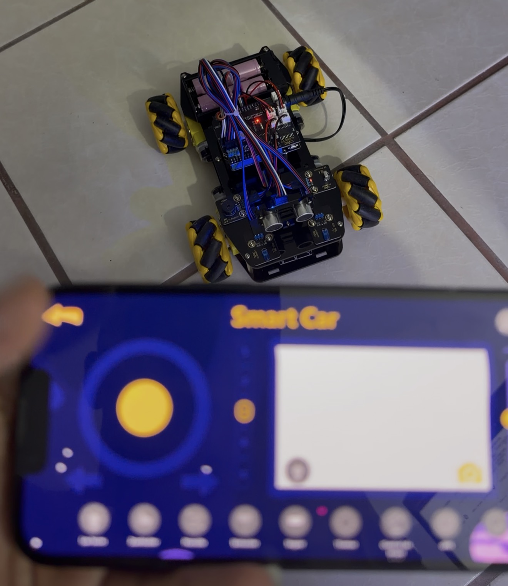
</p>

Controla el carrito desde tu celular usando la app oficial ACEBOTT.

**Cómo conectarse:**
1. Sube el sketch `CAR-SHIELD-QD001_APP` al ESP32
2. Enciende el carrito (interruptor hacia la derecha)
3. El ESP32 crea una red WiFi llamada `ESP32-Car`
4. Conecta tu celular a esa red WiFi — contraseña: `12345678`
5. Abre la app ACEBOTT → Smart Car → Control
6. Toca el ícono de conexión en la esquina superior derecha

**Descargar la app:**
- **Android:** Busca "ACEBOTT" en Google Play
- **iOS:** Busca "ACEBOTT" en la App Store

**Controles disponibles en la app:**
- Panel izquierdo: adelante, atrás, lateral izquierda/derecha, giro izquierda/derecha
- Números del centro: ajuste de velocidad
- Botón giroscopio: controla el movimiento inclinando el teléfono

---

### 📡 Modo Control Infrarrojo (IR)

<p align="center">
  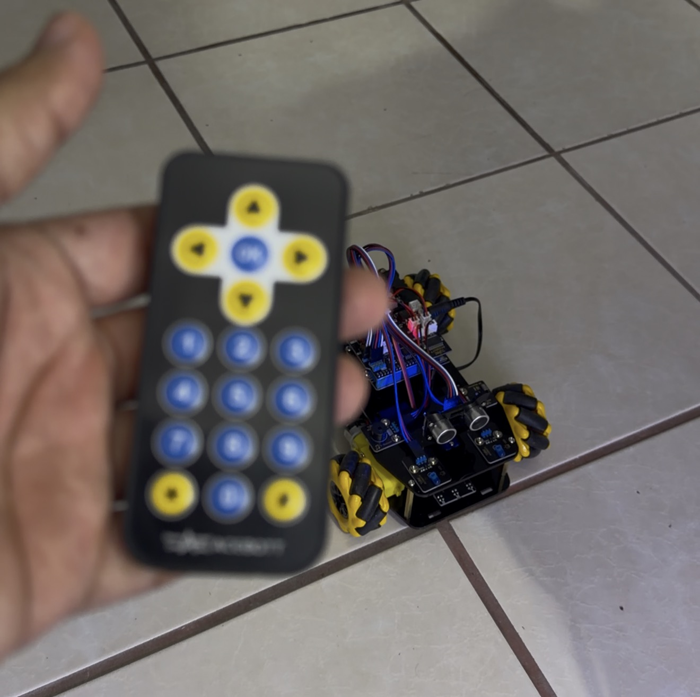
</p>

Controla el carrito con el mando infrarrojo incluido en el kit.

**Cómo usar:**
1. Sube el sketch `CAR-SHIELD-QD001_IR`
2. Enciende el carrito
3. Apunta el control al sensor IR del carrito y presiona los botones

**Mapa de botones:**

| Botón del control | Acción del carrito |
|-------------------|--------------------|
| ⬆️ Flecha arriba | Avanzar |
| ⬇️ Flecha abajo | Retroceder |
| ⬅️ Flecha izquierda | Giro a la izquierda |
| ➡️ Flecha derecha | Giro a la derecha |
| Botón `1` | Movimiento lateral izquierda |
| Botón `3` | Movimiento lateral derecha |
| Botón `OK` | Detener |

---

### 🎮 Modo ESP-NOW (Control remoto con ESP32 + Joysticks)

<p align="center">
  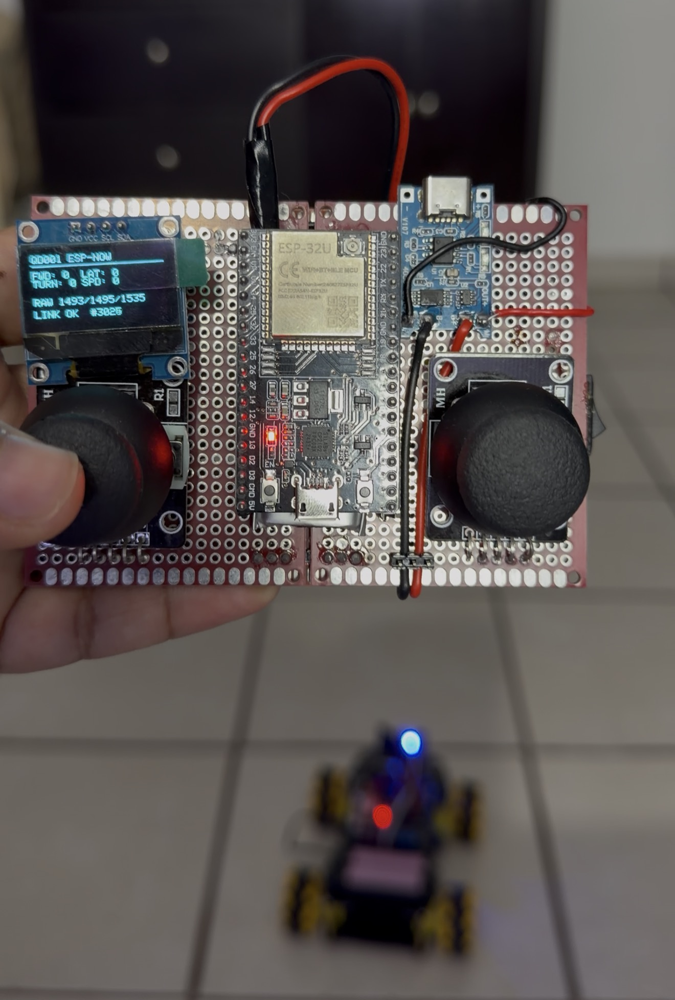
</p>

Modo avanzado de control remoto usando un segundo ESP32 con joysticks analógicos y pantalla OLED. Basado en el diseño del control de drone de PepeAngell.

Este modo requiere **dos ESP32**: uno en el carrito y otro como control.

**Carrito (receptor):** Sketch `CAR-SHIELD-QD001_ESPNOW`

**Control (transmisor):** Sketch `CONTROL-QD001_ESPNOW`

**Pines del control remoto ESP32:**

| Pin ESP32 del control | Función |
|-----------------------|---------|
| GPIO 34 | Joystick adelante/atrás |
| GPIO 32 | Joystick lateral izquierda/derecha |
| GPIO 33 | Joystick giro izquierda/derecha |
| GPIO 13 | Botón SW del joystick izquierdo (claxon) |
| SDA/SCL | OLED SSD1306 I2C (dirección 0x3C) |

**Configuración importante — MAC del carrito:**

Antes de subir el sketch al control, debes conocer la dirección MAC del ESP32 del carrito. Para obtenerla:

1. Sube `CAR-SHIELD-QD001_ESPNOW` al carrito
2. Abre el Monitor Serial (115200 baudios)
3. El carrito imprimirá su dirección MAC, por ejemplo: `MAC: 30:76:F5:05:C2:74`
4. Edita la línea en `CONTROL-QD001_ESPNOW.ino`:

```cpp
uint8_t carAddress[] = {0x30, 0x76, 0xF5, 0x05, 0xC2, 0x74};
```

Reemplaza los valores con la MAC de tu carrito.

**Característica de seguridad:** Si el control se desconecta por más de 500 ms, el carrito se detiene automáticamente.

---

### 🤖 Modo Autónomo (Evasión de obstáculos)

El modo más avanzado — el carrito se mueve solo y esquiva obstáculos usando el sensor ultrasónico + servo.

**Sketch:** `CAR-SHIELD-QD001`

**Cómo funciona:**
1. El servo mantiene el sensor ultrasónico mirando al frente
2. Si detecta un objeto a menos de 22 cm, se detiene
3. Escanea izquierda, frente y derecha con el servo
4. Retrocede si está demasiado cerca (menos de 14 cm)
5. Se mueve lateralmente y gira hacia el lado más libre
6. Verifica que el frente esté despejado antes de continuar

**Parámetros configurables en el código:**

```cpp
#define DIST_SAFE     32   // distancia mínima para avanzar libremente (cm)
#define DIST_DANGER   22   // distancia para iniciar evasión (cm)
#define DIST_CRITICAL 14   // distancia para retroceso largo (cm)

#define SERVO_LEFT    0    // ángulo izquierda del servo
#define SERVO_CENTER  85   // ángulo centro del servo (calibrado)
#define SERVO_RIGHT   180  // ángulo derecha del servo

#define SPEED_MOVE    205  // velocidad de avance
#define SPEED_BACK    205  // velocidad de retroceso
#define SPEED_TURN    220  // velocidad de giro
```

---

## 📂 Descripción de cada sketch

### `CAR-SHIELD-QD001/` — Modo autónomo con evasión robusta

El sketch principal del proyecto. El carrito evita obstáculos de forma autónoma usando el sensor ultrasónico montado en el servo.

**Características:**
- Mide distancia promediando 5 lecturas para mayor precisión
- Escanea izquierda y derecha **antes** de retroceder para decidir mejor
- Usa movimiento lateral (ruedas Mecanum) + giro combinado para escapar
- Pulso de arranque (`KICK_SPEED`) para vencer la inercia al inicio de cada movimiento
- Hasta 3 intentos de escape antes de activar modo de emergencia
- LEDs indican dirección: ambos = frente/atrás, uno solo = giro

**Placa:** ESP32 Dev Module

---

### `CAR-SHIELD-QD001_APP/` — Control por app ACEBOTT (WiFi)

Permite controlar el carrito manualmente desde la app oficial ACEBOTT.

**Características:**
- Crea punto de acceso WiFi `ESP32-Car` / contraseña `12345678`
- Protocolo de comunicación binario de la app ACEBOTT por puerto TCP 100
- Velocidad ajustable desde la app (120–255)
- Se detiene automáticamente si la app se desconecta

---

### `CAR-SHIELD-QD001_IR/` — Control por mando infrarrojo

Controla el carrito con el mando IR incluido en el kit.

**Características:**
- Receptor en GPIO 4
- Soporte para botón de repetición del control (mantener pulsado)
- Timeout de 180 ms: si no recibe nueva señal, el carrito se detiene
- Soporta los 6 movimientos de las ruedas Mecanum

---

### `CAR-SHIELD-QD001_ESPNOW/` — Receptor ESP-NOW

Se sube al ESP32 del carrito para recibir comandos desde el control remoto ESP32.

**Características:**
- Protocolo ESP-NOW (sin WiFi, comunicación directa ESP32 a ESP32)
- Estructura de comando: adelante/atrás, lateral, giro, velocidad, claxon y contador
- Para de motores si pierde el enlace por más de 500 ms
- Imprime telemetría por Monitor Serial cada 300 ms

---

### `CONTROL-QD001_ESPNOW/` — Transmisor ESP-NOW (control remoto)

Se sube a un segundo ESP32 con joysticks y pantalla OLED para controlar el carrito de forma remota.

**Características:**
- Calibración automática del punto cero de los joysticks al encender
- Zona muerta configurable (420 de 4095) para evitar deriva
- Velocidad proporcional a la posición del joystick
- Pantalla OLED muestra valores en tiempo real + estado del enlace
- Envío cada 35 ms para control fluido

---

### `CAR-SHIELD-QD003_CAMERA_TEST/` — Prueba de cámara QD003

Sketch de prueba para la expansión de cámara IA QD003 (K210). No mueve motores.

**Modos de la cámara disponibles:**

| Tecla en Monitor Serial | Modo |
|-------------------------|------|
| `m` | Menú/default |
| `q` | Lectura de QR |
| `b` | Código de barras |
| `c` | Reconocimiento de color |
| `f` | Detección de caras |
| `n` | Reconocimiento de números |
| `v` | Seguimiento visual de línea |
| `t` | Semáforos / tráfico |
| `i` | Reconocimiento de imágenes |
| `l` | Machine learning personalizado |

**Conexión de la cámara:**

| Cable QD003 | Pin ESP32 |
|-------------|-----------|
| TX | GPIO 21 (RX del ESP32) |
| RX | GPIO 22 (TX del ESP32) |
| VCC | VCC |
| GND | GND |

---

### `CAR-SHIELD-QD003_UART0_AUTO_TEST/` — Prueba automática de cámara

Similar al anterior pero cambia de modo automáticamente cada 5 segundos. Útil para verificar que todos los modos de la cámara funcionan.

> ⚠️ **Importante:** Sube el sketch con la cámara **desconectada**. Una vez subido, conecta la cámara al puerto UART del Shield y reinicia el ESP32.

---

### `CAR-SHIELD-QD003_APP_CONTROL/` — App + carro + QD003

Modo para manejar el carro desde la app ACEBOTT y controlar la expansión QD003.

- WiFi: `ESP32_QD003`
- Password: `12345678`
- Puerto app: `100`
- Movimiento del carro con pulso de arranque.
- Servo de cámara en `GPIO25`.
- Cámara QD003 por puerto físico `UART` del shield:
  - `RX=GPIO3`
  - `TX=GPIO1`
- Soporta comandos de modos QD003: QR, barcode, color, face, image, visual patrol, traffic y machine learning.

> ⚠️ **Importante:** Como usa el puerto UART físico del shield, sube el sketch con la QD003 desconectada. Después de subir, conecta la cámara y reinicia el ESP32.

> Nota: QD003 es módulo de visión IA/K210. No es la expansión ESP32-CAM de video MJPEG en vivo; para video en vivo desde la app normalmente se usa QD002. QD003 manda resultados de visión por UART y muestra la imagen en su propia pantalla.

---

## 🔬 Tests individuales de componentes

La carpeta `TEST CAR-SHIELD/` contiene sketches simples para verificar cada componente por separado. **Úsalos para diagnosticar problemas** antes de usar los sketches principales.

### Orden recomendado de pruebas

#### 1️⃣ `01_leds/` — Verificar LEDs y buzzer

Enciende y apaga ambos LEDs alternadamente cada 500 ms y emite un beep al iniciar.

**Resultado esperado:** Ambos LEDs parpadean y se escucha un beep al encender.

---

#### 2️⃣ `02_motores/` — Verificar motores y ruedas Mecanum

Ejecuta los 6 movimientos disponibles en secuencia: adelante, atrás, lateral izquierda, lateral derecha, giro horario, giro antihorario.

**Resultado esperado:** El carrito realiza cada movimiento durante 800 ms con una pausa entre cada uno.

> ℹ️ Para esta prueba, eleva el carrito del suelo o colócalo en una zona despejada.

---

#### 3️⃣ `03_servo_serial/` — Calibrar el servo

Mueve el servo a diferentes ángulos automáticamente y luego permite enviar ángulos por el Monitor Serial (0–180).

**Cómo usar:**
1. Sube el sketch
2. Abre el Monitor Serial a 115200 baudios
3. Escribe un número entre `0` y `180` y presiona Enter
4. El servo se moverá a ese ángulo
5. El centro actual calibrado del proyecto es `85` — si el sensor no apunta exactamente al frente con ese valor, ajústalo en el sketch principal

---

#### 4️⃣ `04_evasion_basica/` — Verificar sensor ultrasónico

Versión simplificada de la evasión. El carrito avanza y gira cuando detecta un obstáculo a menos de 20 cm. Sin LEDs ni buzzer.

**Resultado esperado:** Avanza, detecta obstáculo, escanea izquierda y derecha, gira hacia el lado más libre.

---

#### 5️⃣ `05_evasion_ultra_servo_led_buzzer/` — Prueba completa de evasión

Versión más completa con LEDs, buzzer y servo. Incluye la lógica mejorada de escanear **antes** de retroceder.

---

## ❓ Preguntas frecuentes y solución de problemas

### El carrito no aparece como puerto COM en Windows

- ✅ Verifica que el switch de la placa esté encendido
- ✅ Usa un cable USB de datos (no solo de carga)
- ✅ Instala el driver CH340
- ✅ Prueba con un puerto USB diferente de tu computadora
- ✅ Revisa el Administrador de dispositivos — busca `USB-SERIAL CH340`

---

### Arduino IDE muestra error al compilar

Los errores más comunes y su solución:

| Error | Solución |
|-------|----------|
| `ACB_SmartCar_V2.h: No such file` | Instala la librería `ACB_SmartCar_V2.zip` |
| `ESP32Servo.h: No such file` | Instala la librería `ESP32Servo.zip` |
| `IRremote.h: No such file` | Instala la librería `IRremote.zip` |
| `Board not selected` | Selecciona **ESP32 Dev Module** en Herramientas → Placa |
| `Sketch uses too much program storage` | Normal en ESP32 con WiFi — no es un error real si compila |

---

### El carrito se mueve en direcciones incorrectas

Las ruedas Mecanum son muy sensibles a la orientación. Verifica:

1. ¿Están instaladas en la posición correcta? (los rodillos deben seguir el patrón del manual)
2. ¿Los motores están conectados a las salidas correctas del Shield?
3. Corre el sketch `02_motores` y verifica que cada comando mueva el carrito en la dirección esperada

---

### El sensor ultrasónico siempre devuelve 999

- Verifica la conexión: TRIG en GPIO 13, ECHO en GPIO 14
- El valor `999` significa que no recibió eco (objeto demasiado lejos, demasiado cerca o cable mal conectado)
- Usa el Monitor Serial — el sketch principal imprime la distancia en tiempo real

---

### El servo no gira o va a posiciones incorrectas

- Verifica que el cable amarillo esté en GPIO 25
- Calibra el centro con el sketch `03_servo_serial`
- El centro real puede variar ligeramente entre unidades — el valor calibrado en este proyecto es `85`

---

### La app ACEBOTT no encuentra el WiFi `ESP32-Car`

- Verifica que el sketch `CAR-SHIELD-QD001_APP` esté subido (no el autónomo)
- El carrito debe estar encendido y el LED de la placa debe parpadear
- En iPhone, desactiva "Unirse a redes automáticamente" y conecta manualmente
- La red WiFi usa el canal 5 — algunos celulares pueden tardar en verla

---

### El control ESP-NOW no conecta al carrito

- La dirección MAC del carrito debe estar escrita correctamente en el sketch del control
- Ambos ESP32 deben estar en el mismo canal WiFi (canal 0 = automático)
- Sube primero el sketch al carrito, anota la MAC del Monitor Serial, luego edita y sube el control

---

## 📦 Paquetes de expansión compatibles

El QD001 es la base de un ecosistema de expansiones ACEBOTT:

| Expansión | Descripción |
|-----------|-------------|
| **QD002** | Cámara ESP32-CAM para transmisión de video |
| **QD003** | Módulo de visión IA con chip K210 — reconocimiento de caras, colores, QR, líneas |
| **QD004** | Transformación en robot tanque con orugas |
| **QD005** | Lanzador de bolas de agua |
| **QD007** | Brazo robótico de 5 grados de libertad |
| **QD008** | Panel solar para carga de baterías |
| **QD009** | Módulo GPS |
| **QD010** | Control remoto inalámbrico tipo PS3 |
| **QD023** | Guante de detección de movimiento por gestos |

Para más información sobre paquetes de expansión y tutoriales detallados:
👉 [https://acebott.com/tutorial/](https://acebott.com/tutorial/)

---

## 📬 Créditos y soporte

- **Kit:** ACEBOTT QD001 — [www.acebott.com](https://www.acebott.com)
- **Soporte oficial ACEBOTT:** support@acebott.com
- **Garantía:** Componentes electrónicos 3 meses / Placa de circuito 1 año
- **Sketches y documentación:** PepeAngell

### Recursos adicionales

- 📺 Video de ensamblaje oficial: escanea el código QR del manual físico
- 📖 Tutorial completo del vehículo: incluido en la carpeta del proyecto (`Tutorial del vehículo inteligente QD001 V2.pdf`)
- 🌐 Tutoriales en línea: [https://acebott.com/tutorial/](https://acebott.com/tutorial/)

---

<p align="center">
  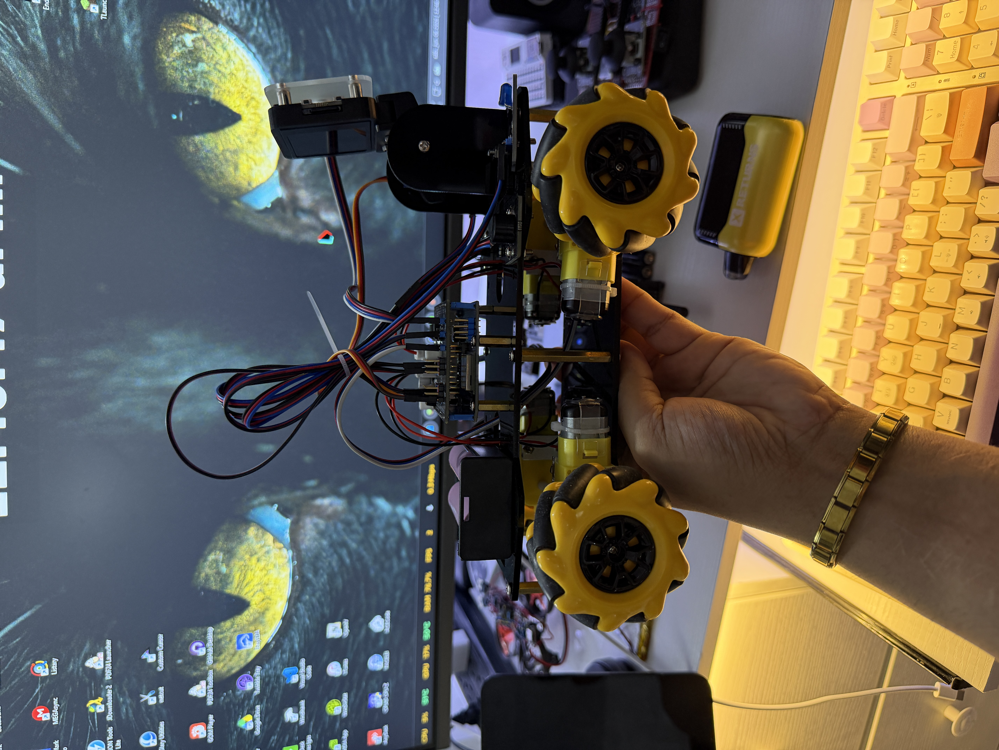
  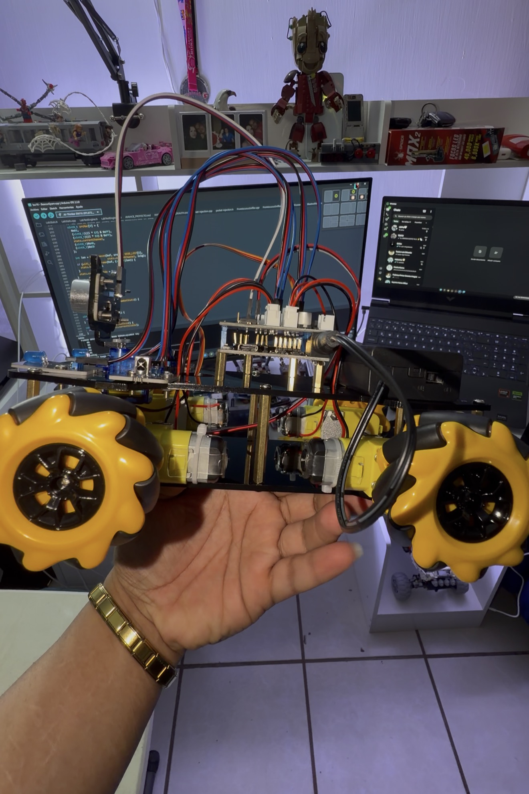
</p>

<p align="center">
  <em>ACEBOTT QD001 — Kit educativo de robótica con ESP32 y ruedas Mecanum</em>
</p>
